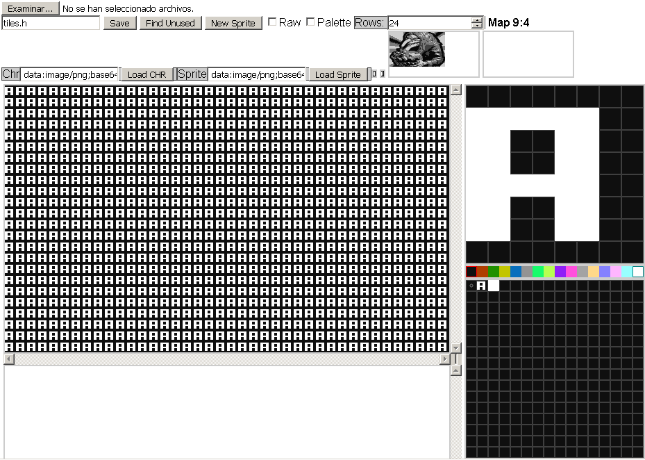
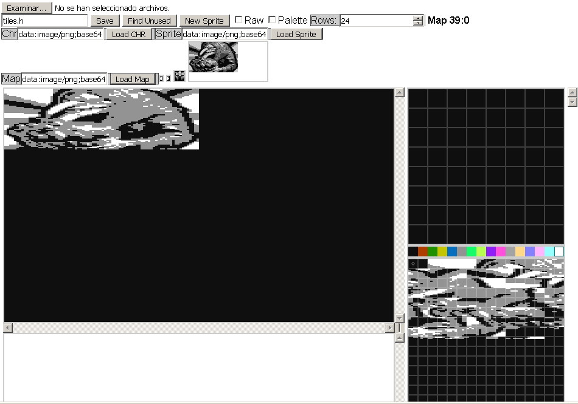
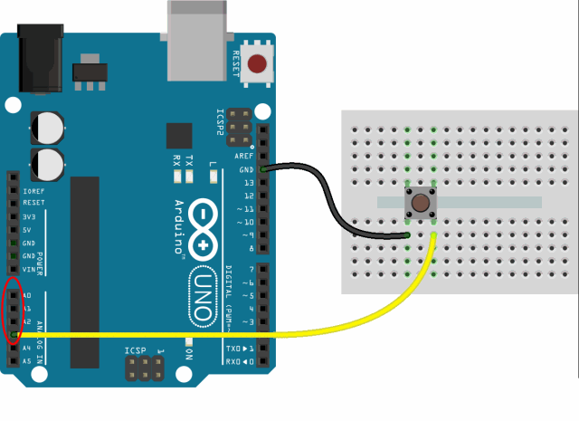
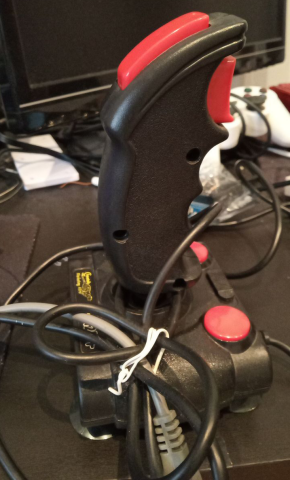
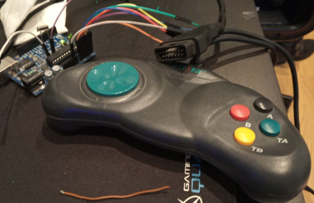
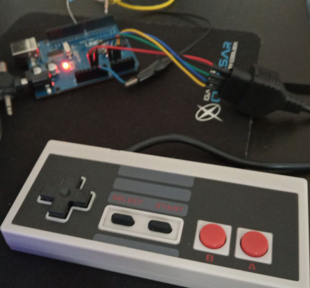
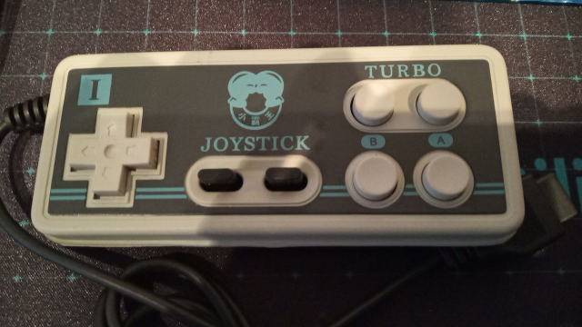

# Arduino Video Console demoscene
<h1>Retro diskmag EXILIUM port Arduino</h1>
Video console emulate with Arduino

<h1>Change</h1>
You choose to use the Arduinocade hardware (https://github.com/rossumur/Arduinocade), and modify the libraries and utilities:
The sprite editing tool is allowed to use the background color with the right mouse button, while the left is the foreground. This allows you to draw more quickly.
  
Add support to load chr A (base64 16 colours) in tile.
  
Add support to load Map (automatic sprite to tiles and map 40x24).

Demostration with Arduino uno chino with ch340. Change power supply external to 5.2v to get hsync correct. cut the temples of the crystal to the minimum.

<h1>Hardware</h1>
<ul>
 <li>Arduino atmega328</li>
 <li>crystal 28.6363 Mhz</li>
 <li>crystal 16 Mhz (optional switch)</li>
 <li>switch crystals</li>
 <li>i2C eprom 24LC256 (optional)</li>
 <li>1 rca video</li>
 <li>1 jack audio output mono</li>
 <li>gamepad atari 5 buttons</li>
 <li>gamepad nes</li>
 <li>gamepad snes</li>
 <li>audio input 1wire capacitor to transfer program (optional)</li>
 <li>bootloader i2c eprom (optional)</li>
 <li>16 colours up 27 colours opcional</li>
 <li>NTSC colour</li>
 <li>tilemap 40x24</li>
 <li>sprites 4x8 pixels</li>
 <li>resolution 160x192</li>
</ul>

<h1>Gamepad simple swith</h1>

I have made a trial version that uses 4 buttons in ground pullpup mode only for PACMAN game. I used the pins:
<ul>
 <li>A0 (pin 14) UP</li>
 <li>A1 (pin 15) DOWN</li>
 <li>A2 (pin 16) LEFT</li>
 <li>A3 (pin 17) RIGHT</li>
</ul>

Support Atari db9. Test with Joy Cheetah 125+.

It is defined in the file config.h
<ul>
 #ifdef _use_gamepad_atari 
  #define pin_btn_up 14 
  #define pin_btn_down 15 
  #define pin_btn_left 16 
  #define pin_btn_right 17 
 #endif 
</ul> 

I have converted a DB15 joystick from PC to db9 atari standard. I have removed all the active circuitry, and I have only left the buttons in passive mode to ground. 

In file arduinocade.cpp, setup pullup input:
<ul>
#ifdef _use_gamepad_atari 
 void setup() 
 { 
    pinMode(pin_btn_up,INPUT_PULLUP); //Joystick UP atari 
    pinMode(pin_btn_down,INPUT_PULLUP); //Joystick DOWN atari 
    pinMode(pin_btn_left,INPUT_PULLUP); //Joystick LEFT atari 
    pinMode(pin_btn_right,INPUT_PULLUP); //Joystick RIGHT atari 
    ... 
 } 
 #endif 
</ul>
</code>

And file PACMAN.INO
<ul>
byte ChooseDir(int dir, Sprite* s) 
{ 
 .... 
            if (choice[0] != 0x7FFF && (digitalRead(pin_btn_up)==LOW)) return MUp; 
            if (choice[1] != 0x7FFF && (digitalRead(pin_btn_left)==LOW)) return MLeft; 
            if (choice[2] != 0x7FFF && (digitalRead(pin_btn_down)==LOW)) return MDown; 
            if (choice[3] != 0x7FFF && (digitalRead(pin_btn_right)==LOW)) return MRight; 
} 
</ul>

Remove or comment call joystick IR and Intelligent Artificial
<ul>
 //test        if (_ai && *readJoy()) { 
</ul>

I am currently developing a version that eliminates the entire keyboard library and infrared joysticks, saving us 570 bytes of flash and 20 bytes of RAM, but I have to test it well, since the original keyboard's reading is embedded in the interrupt routine for each generation of line, so it has to behave the same with the same times but without executing the same.

  
<h1>NES controller</h1>

I have made a trial version that uses original and clone NES controller (NESpad 1.2 library) for PACMAN game. I used the pins:

<ul>
 <li>A0 (pin 14) strobe</li>
 <li>A1 (pin 15) clk</li>
 <li>A2 (pin 16) data</li> 
</ul>

It is defined in the file config.h
<ul>
  #ifdef _use_gamepad_nes 
  #define pin_nes_strobe 14 
  #define pin_nes_clock 15 
  #define pin_nes_data 16 
 #endif 
</ul>

At the beginning I used the library NESpad 1.2, but then I decided to make a custom code, to resize to 1 byte ram usage and 234 bytes of code. The code remove the delayMicroseconds, to test. It may be necessary in some gamepad.

PACMAN.INO
<ul>
#include <NESpad.h> 
... 
#ifdef _use_gamepad_nes  
 byte state = 0; 
 byte nes_state = 0; 
 byte NESreadButtons(void); 
 byte NESshiftin(void); 
 void NESstrobe(void); 
#endif 
... 
            #ifdef _use_gamepad_nes 
             nes_state = NESreadButtons(); 
             if (choice[0] != 0x7FFF && (nes_state & NES_UP)) return MUp; 
             if (choice[1] != 0x7FFF && (nes_state & NES_LEFT)) return MLeft; 
             if (choice[2] != 0x7FFF && (nes_state & NES_DOWN)) return MDown; 
             if (choice[3] != 0x7FFF && (nes_state & NES_RIGHT)) return MRight;             
            #endif 
</ul>

  
<h1>MEGADRIVE controller</h1>

I have made a trial version that uses original and clone megadrive controller (Sega Controller library) for PACMAN game. I used the pins:

      

<!--<h1>First prototype (deprecated)</h1>
Minimum videoconsole (one chip) ARDUINO (ATMEGA 328P) with video TV output (DAC R2R 4 bits 16 colors grayscale), and sound (DAC R2R 4 bits) 

 
Parser emulator in Javascript, which allows you to generate a game with the different video modes:
<ul>
 <li>84x48 (framebuffer 4 and 8 colors)</li>
 <li>84x64 (framebuffer 4 colors)</li>
 <li>96x64 (framebuffer 4 colors)</li>
 <li>96x96 (tiles)</li>
 <li>128x96 (tiles)</li>
 <li>128x128 (tiles)</li>
 <li>256x128 (tiles)</li>
 <li>480x240 (tiles)</li>
</ul>
 Tiles mode combination with framebuffer. 
 With code in JS and P5JS, video output can be simulated, allowing intermediate C code for Arduino, which can later be compiled and viewed in real chip.  
 It uses a hardware similar to the TVOUT of arduino, but with multiple improvements, to be able to support 16 shades of gray.  
 Old diskmag <a href='http://www.pouet.net/prod.php?which=5967'>EXILIUM</a> port for minimal hardware chip ATMEGA328 (32 KB) gfx text mode.
-->

<h1>Preview development</h1>
Here are some previews with the new tool I've modified. It's not uploaded yet, since it has some bugs, but it allows to convert bitmaps up to 160x192 pixels into tiles with the exact arduinocade palette, deleted repeated. We can see the possibilities.

   

<h1>State project</h1>
In development

I am developing a program to test an NES and ATARI controller. I have reduced all the code to the minimum version, and I am even modifying the generation of sound waves to reduce the lookup table.
Check buttons nes controller (up, down, left, right, select, start, A, B).
4348 bytes. Not data sound and kernel, and not ir keyboard and joysticks.
Test in Arduino Duemilanove ATMEGA328p with mod bootloader 28 mhz mod.
I am also developing a version that works with IDE 1.8.9, but for now it is 100% functional, since some visual defect of the tiles is generated.

<!--
Videoconsola minima (un solo chip) ARDUINO (ATMEGA 328P) con salida de video TV (DAC R2R 4 bits 16 colours escala de grises), and sound (DAC R2R 4 bits)
Emulador Parser en Javascript, que permite generar un juego con los diferentes modos de videos:
<ul>
 <li>84x48 (framebuffer 4 y 8 colores)</li>
 <li>84x64 (framebuffer 4 colores)</li>
 <li>96x64 (framebuffer 4 colores)</li>
 <li>96x96 (tiles)</li>
 <li>128x96 (tiles)</li>
 <li>128x128 (tiles)</li>
 <li>256x128 (tiles)</li>
 <li>480x240 (tiles)</li>
 </ul>
 Combinacion de modo Tiles con framebuffer.
-->
 <!--Con codigo en JS y P5JS, se puede simular la salida de video, permitiendo generar código intermedio en C para Arduino, que posteriormente se puede compilar y ver en chip real.-->

 <!--Se utiliza un hardware similar al TVOUT de arduino, pero con múltiples mejoras, al poder soportar 16 tonalidades de gris.
 Se portará la vieja diskmag multiplataforma EXILIUM de mi grupo SLIDERS a un chip ATMEGA328 (32 KB).
-->
